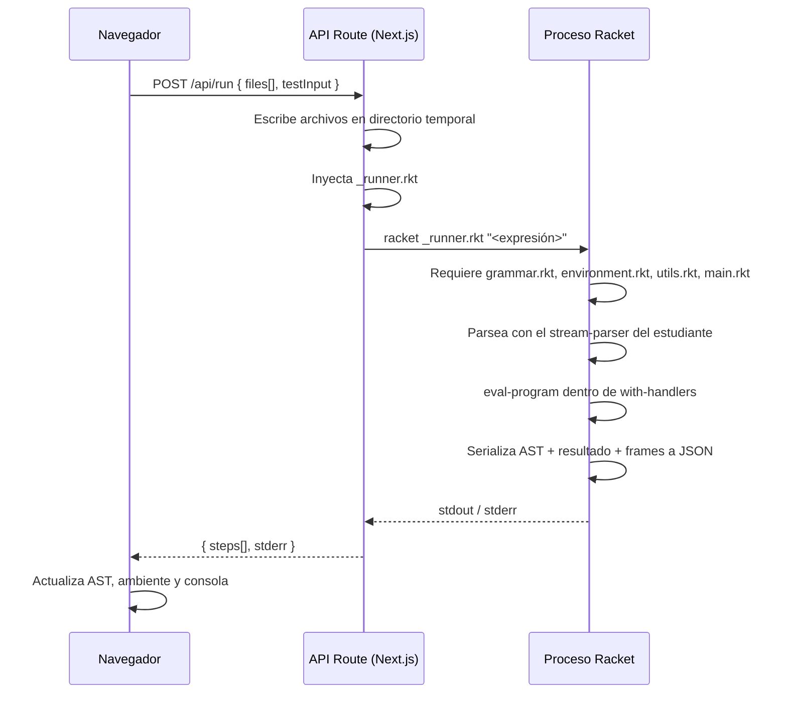

# FLP Viewer

[](https://sonarcloud.io/summary/new_code?id=Esmeralda-RG_flp-viewer)
[](https://sonarcloud.io/summary/new_code?id=Esmeralda-RG_flp-viewer)

Prototipo web educativo desarrollado como trabajo de grado en Ingeniería de Sistemas, Universidad del Valle sede Tuluá. Su propósito es apoyar la comprensión de los conceptos fundamentales de la asignatura **Fundamentos de Interpretación y Compilación de Lenguajes de Programación (FLP)** mediante la visualización interactiva de estructuras internas —árboles de sintaxis abstracta y ambientes de ejecución— generadas a partir de intérpretes implementados por los estudiantes en Racket/EOPL.

---

## Stack

| Capa | Tecnología |
|---|---|
| Framework | Next.js 16 (App Router) |
| UI | React 19, Tailwind CSS v4, TypeScript 5 |
| Editor | Monaco Editor (`@monaco-editor/react` v4.7, cargado con `ssr: false`) |
| Layout | `react-resizable-panels` v4 (`Group` / `Separator`) |
| Intérprete | Racket (proceso externo vía `execFile`) |
| Empaquetado | JSZip (descarga del proyecto) |
| Package manager | pnpm |

---

## Especificación léxica

El modal de generación dispone de dos áreas de entrada: **Especificación Léxica** y **Gramática BNF**.

En el área léxica se escribe un nombre de token por línea. El generador reconoce los siguientes nombres predefinidos y los expande a las reglas SLLGEN correspondientes:

| Nombre | Descripción |
|---|---|
| `number` | Enteros positivos y negativos |
| `float` | Números decimales positivos y negativos |
| `identifier` | Identificadores alfanuméricos (letra seguida de letras, dígitos o `?`) |
| `binary` | Literales binarios con prefijo `b` |
| `octal` | Literales octales con prefijo `0x` |
| `hex` | Literales hexadecimales con prefijo `hx` |
| `text` / `string` | Cadenas entre comillas dobles |

`whitespace` y `comment` (comentarios de línea con `//`) se incluyen siempre de forma automática.

Si el área léxica se deja vacía, se incluye el conjunto completo de tokens por defecto (`identifier`, `number`, `float`, `binary`, `octal`, `hex`).

Para un token no listado arriba, se puede escribir directamente la regla en notación SLLGEN comenzando con `(`:

```
(boolean ("true") boolean)
(boolean ("false") boolean)
```

---

## Integración con Racket

El intérprete no corre en el servidor Next.js — se delega a un proceso Racket externo por cada ejecución:



### Instrumentación del ambiente

`environment.rkt` incluye un bloque de tracking (delimitado por `FLP-VIEWER-TRACKING-START/END`) que monkey-patchea `extend-env` al cargarse el módulo. Cada llamada a `extend-env` registra un snapshot del ambiente en `_env-log`. El runner lee ese log al finalizar la evaluación e incluye los frames en el JSON de respuesta. Este bloque se elimina automáticamente al descargar el ZIP, dejando el archivo limpio para uso en DrRacket.

---

## Instalación y ejecución local

### Requisitos

- Node.js >= 20 y pnpm
- [Racket](https://racket-lang.org/) instalado y accesible en el PATH 

### Pasos

```bash
pnpm install

cp .env.example .env
# Editar .env y ajustar RACKET_BIN a la ruta del binario de Racket

pnpm dev
```

Abrir [http://localhost:3000](http://localhost:3000).

---

## Estructura del proyecto

```
app/
  api/run/          → API Route que invoca el proceso Racket
  components/       → Playground, Editor, AST, Ambiente, Consola, Modales
  lib/              → Generadores (BNF, grammar.rkt, main.rkt, environment.rkt)
  services/         → Cliente HTTP hacia /api/run
  types/            → Tipos TypeScript compartidos
examples/           → Plantillas de ejemplo (eopl-template, hola-mundo)
```
